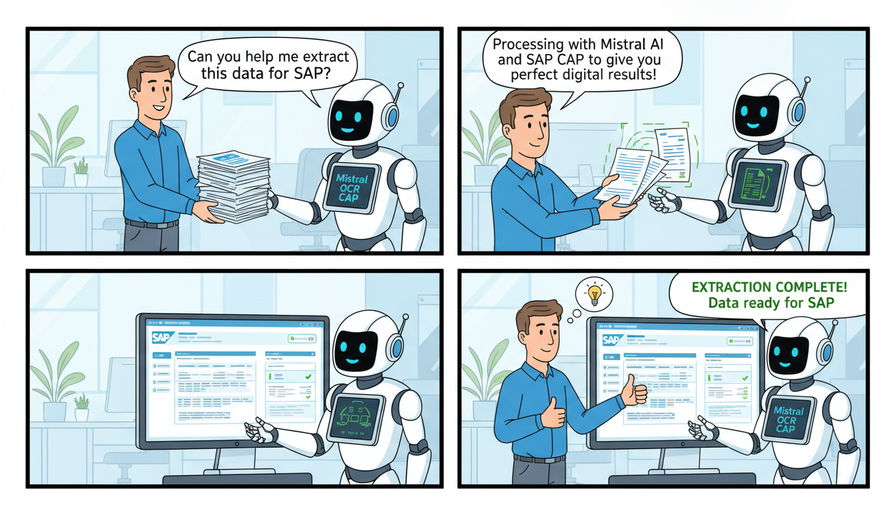

# Mistral OCR CAP Service

A robust SAP Cloud Application Programming Model (CAP) service designed to process PDF documents and perform Optical Character Recognition (OCR) using the Mistral AI API. This service enables developers to extract structured information from scanned documents or PDFs within the SAP BTP ecosystem.

## 🚀 Overview

`mistral-ocr-cap` bridges the gap between document storage and intelligent data extraction. By combining the power of SAP CAP with Mistral AI's advanced language models, this project provides a scalable backend for document processing workflows.

### Key Features
- **PDF Analysis**: Pre-processes PDF files using `pdf-parse` and `pdf2json`.
- **Mistral AI Integration**: Leverages the official Mistral AI SDK to perform high-accuracy OCR.
- **SAP BTP Ready**: Built-in support for XSUAA security, MTA deployment, and SAP HANA.
- **Customizable Logic**: Modular utility structure for PDF analysis and OCR communication.

---

## 🛠️ Tech Stack
- **Framework**: [SAP CAP (Node.js)](https://cap.cloud.sap/)
- **AI Engine**: [Mistral AI API](https://mistral.ai/)
- **Runtime**: Node.js 18+ (ESM)
- **Security**: SAP XSUAA
- **Utilities**: `pdf-parse`, `pdf2json`, `@mistralai/mistralai`

---

## 📂 Project Structure

```text
├── srv/
│   ├── scan-service.cds      # Service definition (OData/REST)
│   ├── scan-service.js       # Main service logic
│   ├── utils/
│   │   ├── mistral-ocr.js    # Mistral AI API wrapper
│   │   └── pdf-analyzer.js   # PDF parsing utilities
│   ├── resources/            # i18n and sample files
│   └── test.http             # API testing file
├── mta.yaml                  # Deployment descriptor for BTP
├── server.js                 # Custom CAP server entry point
└── package.json              # Dependencies and scripts
```

---

## ⚙️ Setup & Installation

### Prerequisites
- [SAP CDS Development Kit](https://cap.cloud.sap/docs/get-started/)
- A Mistral AI API Key

### Installation
1. Clone the repository.
2. Install dependencies:
   ```bash
   npm install
   ```
3. Create a `default-env.json` (or `.env`) file in the root directory to store your credentials:
   ```json
   {
     "MISTRAL_API_KEY": "your_api_key_here"
   }
   ```

---

## 🚀 Usage

### Local Development
To start the service in development mode:
```bash
cds watch
```
The service will be available at `http://localhost:4004`.

### Testing the API
Use the provided `srv/test.http` file or your preferred HTTP client (Postman/cURL) to trigger the OCR process.

**Example Request:**
```http
POST http://localhost:4004/scan/processPdf
Content-Type: application/json

{
    "fileName": "scan_2-27.pdf"
}
```

### Integration Snippet
The core logic resides in `srv/utils/mistral-ocr.js`. Here is how the Mistral client is initialized:

```javascript
import { Mistral } from '@mistralai/mistralai';

const apiKey = process.env.MISTRAL_API_KEY;
const client = new Mistral({ apiKey });

export async function performOcr(pdfBuffer) {
    // Logic to send buffer to Mistral OCR endpoint
    const response = await client.ocr.process({
        model: "mistral-ocr-latest",
        document: {
            type: "content",
            content: pdfBuffer.toString('base64')
        }
    });
    return response;
}
```

---

## ☁️ BTP Deployment

### 1. Build the Project
Generate the deployment MTAR file:
```bash
mbt build
```

### 2. Deploy to Cloud Foundry
Login to your SAP BTP space and deploy:
```bash
cf login
cf deploy mta_archives/mistral-ocr-cap_1.0.0.mtar
```

### 3. Security Configuration
The service is configured to use XSUAA. Ensure your `xs-security.json` is updated. To generate a fresh one:
```bash
cds compile srv --to xsuaa > xs-security.json
```

---

## 📜 Available Scripts

- `npm start`: Standard CAP server startup.
- `cds watch`: Local development with hot-reload.
- `cds watch --profile hybrid`: Runs locally but connects to BTP services (Destinations, XSUAA).

---

## 📝 License
This project is `UNLICENSED`. See the [LICENSE](LICENSE) file for more information.

---
*Created with ❤️ using SAP CAP and Mistral AI.*